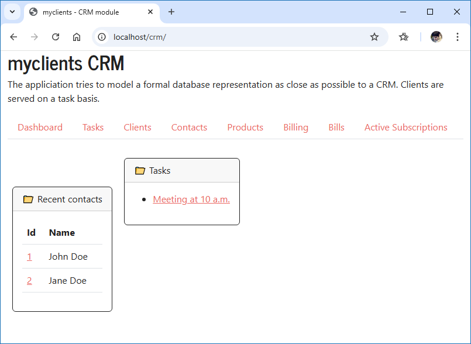

# myclients

  
This application was made for demonstration purposes only and to have a properly configure backend (Oracle MySQL 8.0) tied to a web application. The appliciation tries to model a formal database representation as close as possible to a CRM. Clients are served on a task basis. Usually a few automation testing scripts will be run into this application and validations will be done on database records.

## Software 

- MySQL 8.0 CE
- Python 3
- Theme: Journal (https://bootswatch.com)

